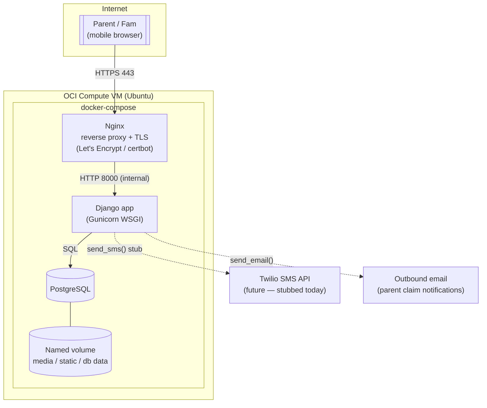
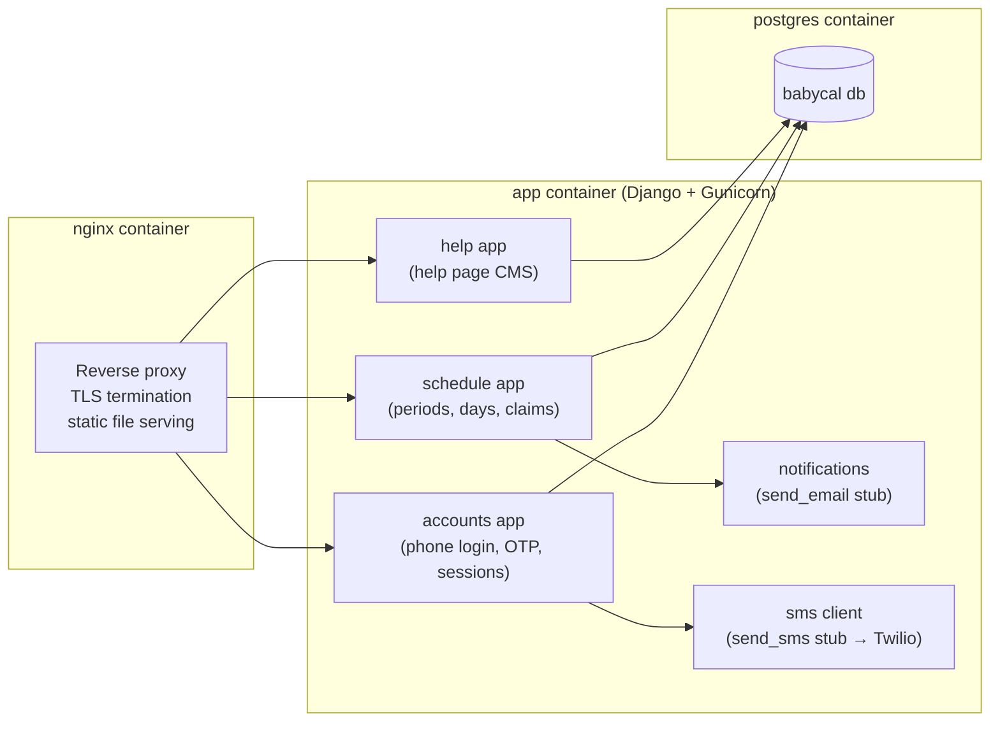
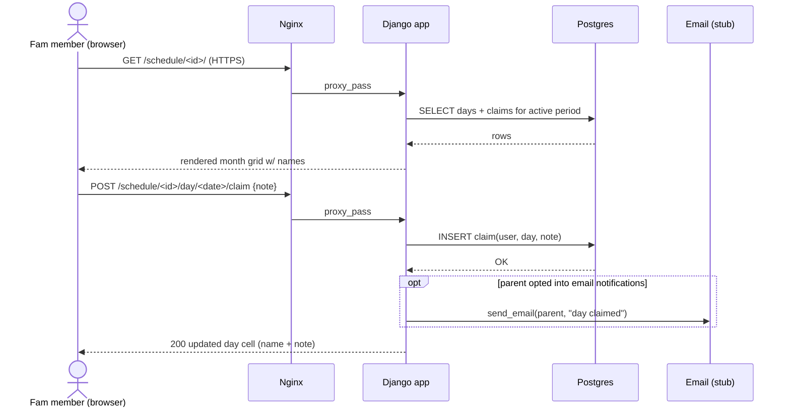
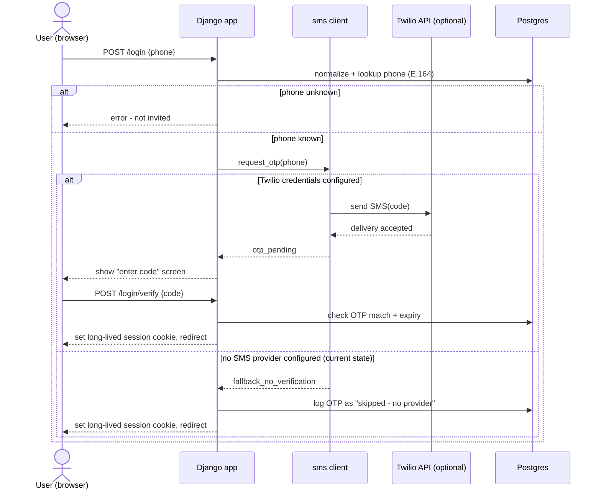

# BabyCal — System Design

Derived from [QA.md](QA.md). Cat (Cookie/Snoopy) feeding-visit scheduler for a small family, self-hosted on an Oracle Cloud Infrastructure (OCI) Compute VM.

---

## 1. Goals & constraints

- Small, trusted user base (2 parents, a handful of fam members) — optimize for simplicity over scale, but keep the door open to grow (multiple schedules, real SMS later).
- No SMS provider yet → phone-based login must degrade gracefully to a no-verification fallback until Twilio is wired up.
- Single VM deployment via Docker Compose; Postgres for real concurrency safety on day-claims; Nginx terminates TLS (Let's Encrypt).
- Django server-rendered templates, no separate SPA/API layer needed for v1.

---

## 2. Deployment architecture

**Notes**
- Only Nginx is exposed publicly (80/443); App and DB stay on the compose-internal network.
- `certbot` renews the Let's Encrypt cert on a timer/cron container or host cron, reloading Nginx.
- Static/media files served by Nginx (or WhiteNoise) from the shared volume; Postgres data lives in its own named volume for durability across container recreation.
- `send_sms()` and `send_email()` are the only two external integration points — both are explicit, swappable functions so Twilio/SMTP can be added without touching call sites.

---

## 3. Container / component view

**Django app breakdown (suggested app layout)**
| App | Responsibility |
|---|---|
| `accounts` | User model, roles (Parent/Fam), phone normalization, OTP model + verify/fallback login, long-lived sessions, invite tokens |
| `schedules` | Schedule periods (profiles), membership, calendar day claims, notes |
| `helppage` | Title/body/links CMS, rich text rendering |
| `notifications` | `send_email()` stub for parent claim alerts |
| `sms` | `send_sms()` stub, feature-flagged fallback logic |

---

## 4. Request flow — claiming a day (happy path)

---

## 5. Request flow — login with graceful SMS fallback

This keeps the real OTP data model and code paths in place now, so flipping on Twilio later is a config change (add API keys, flip a feature flag) rather than a rewrite.

---

## 6. Roles & permissions summary

| Action | Parent | Fam | Baby |
|---|---|---|---|
| Claim/join a day, leave a note | ✅ | ✅ | n/a (no login) |
| Remove own claim | ✅ | ✅ | n/a |
| Remove *anyone's* claim | ✅ | ❌ | n/a |
| Manage users / invites | ✅ | ❌ | n/a |
| Create/edit schedule periods | ✅ | ❌ | n/a |
| Switch between schedules they belong to | ✅ | ✅ | n/a |
| Edit help page | ✅ | ❌ | n/a |
| View help page | ✅ | ✅ | n/a |
| Toggle "email me on claim" | ✅ | ❌ | n/a |

---

## 7. Scaling headroom (kept in mind, not built for v1)

- Multiple `SchedulePeriod` "profiles" with a membership table already supports several concurrent trips/schedules per user — no redesign needed to add more.
- `send_sms()` / `send_email()` are isolated behind single functions, so swapping stub → real Twilio/SMTP is additive.
- Postgres + Docker Compose can move to managed Postgres or a bigger box without app changes if the family list grows.
