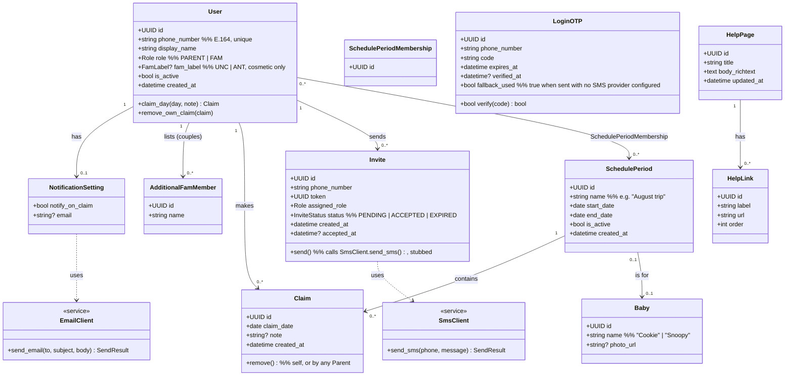
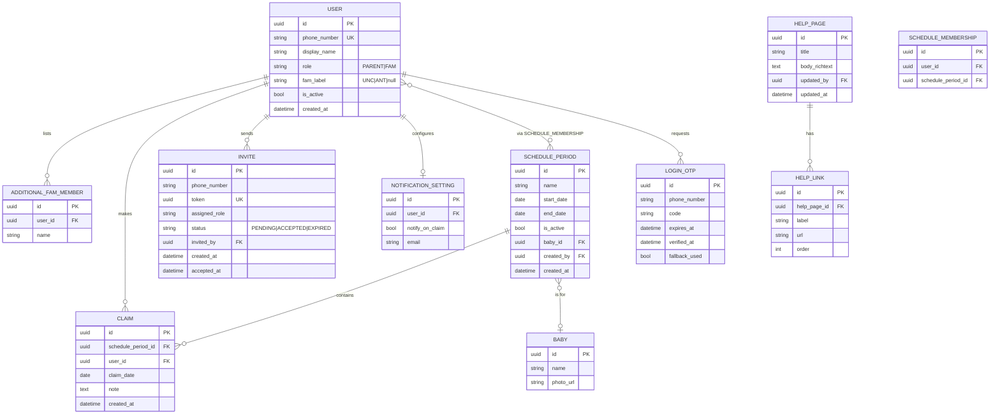
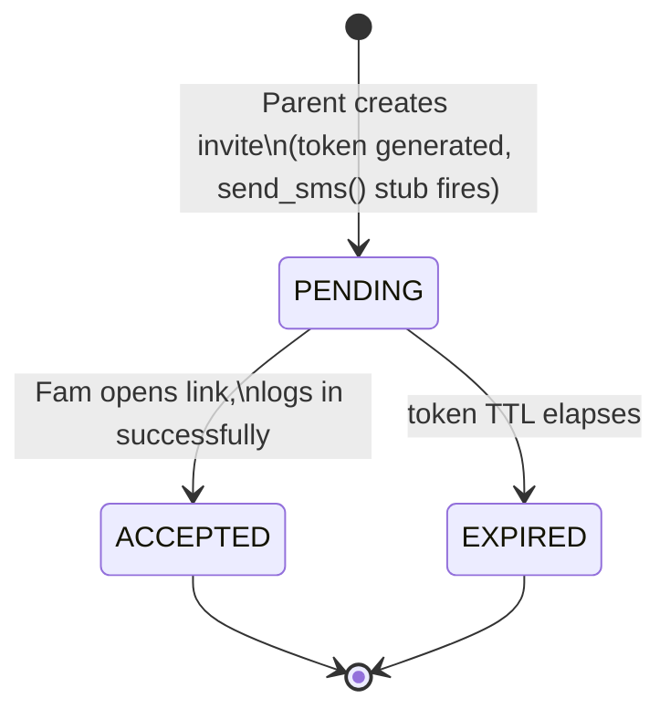
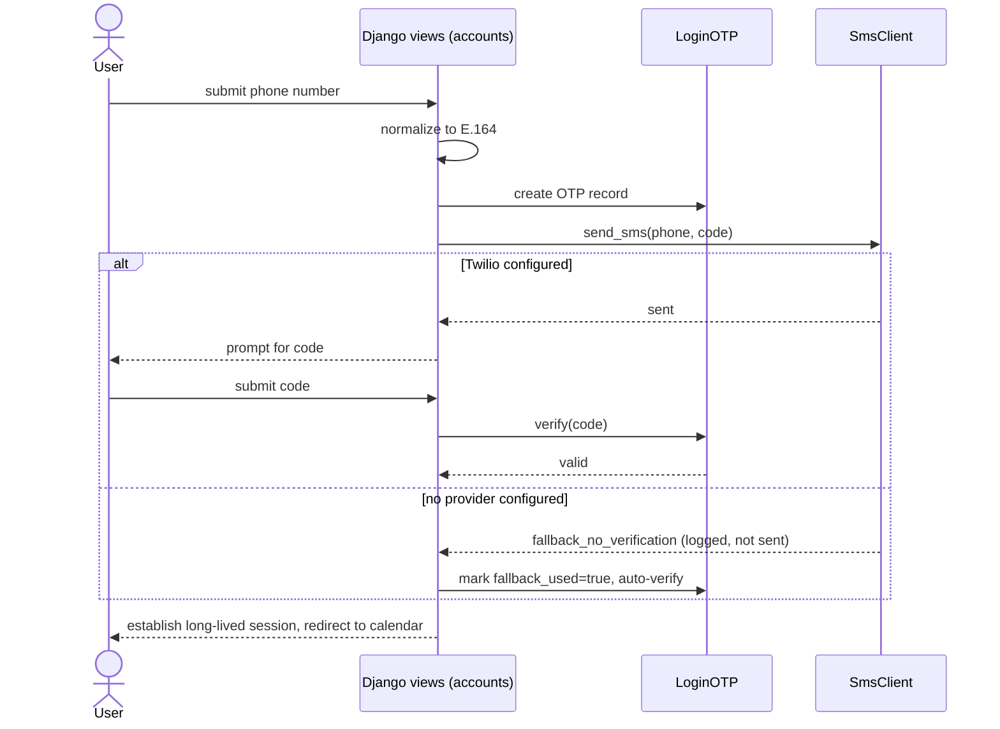
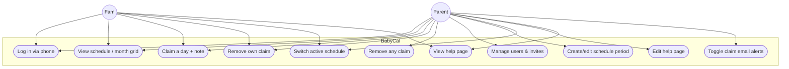

# BabyCal — UML Documentation

Companion to [SYSTEM_DESIGN.md](SYSTEM_DESIGN.md). Derived from [QA.md](QA.md). Diagrams use Mermaid and render in VSCode (with a Mermaid preview extension) and on GitHub.

---

## 1. Domain class diagram

**Key decisions encoded above**
- A day is not its own row — a `Claim` carries `claim_date` directly against a `SchedulePeriod`, and multiple `Claim`s can share the same date (unlimited people per day, per QA §1.3). "Whole day belongs to one claimant unless a second family joins" is a UI/business rule, not a schema constraint.
- `AdditionalFamMember` is deliberately a thin, login-less list of extra display names on a Fam `User` — for couples — matching "this is completely additional" (QA §4.1).
- `SchedulePeriodMembership` is a many-to-many join so a user can belong to and switch between multiple active schedule "profiles" (QA §5.1).
- `fam_label` (unc/ant) is cosmetic only, per QA §2.1 — it carries no permission difference.

---

## 2. Entity-relationship diagram (DB schema)

`CLAIM` has a unique constraint on `(schedule_period_id, claim_date, user_id)` — one claim per user per day, but no limit on distinct users per day (unlimited fam per QA §1.3).

---

## 3. Invite lifecycle (state diagram)

---

## 4. Login sequence (use-case level)

---

## 5. Use-case diagram

